# Lab 02: Bank Database
**Name** Kaniz Fatema  
**ID:** 20245103154

## 1. Creating a new database:

```sql
CREATE DATABASE bank_database;
```
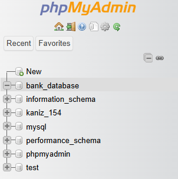

## 2. Create 6 tables in this DB named: `account`, `branch`, `depositor`, `customer`, `loan`, and `borrower`

**Create Account:** 

```sql
CREATE TABLE account (account_number char(5), branch_name varchar(16), balance int(7));
CREATE TABLE branch (branch_name varchar(16), branch_city varchar(16), assets int(8));
CREATE TABLE depositor (customer_name varchar(16), account_number char(5));
CREATE TABLE customer (customer_name varchar(16), customer_street varchar(32), customer_city varchar(16));
CREATE TABLE loan (loan_number char(5), branch_name varchar(16), amount int(8));
CREATE TABLE borrower (customer_name varchar(16), loan_number char(8));
```


## 3. Inserting data into the tables

**Account:**

```sql
INSERT INTO account VALUES("A-101", "Downtown", 500);
INSERT INTO account VALUES("A-102", "Perryridge", 400);
INSERT INTO account VALUES("A-201", "Brighton", 900);
INSERT INTO account VALUES("A-215", "Mianus", 700);
INSERT INTO account VALUES("A-217", "Brighton", 750);
INSERT INTO account VALUES("A-222", "Redwood", 700);
INSERT INTO account VALUES("A-305", "Round Hill", 350);
```


**Branch:**

```sql
INSERT INTO branch VALUES("Brighton", "Brooklyn", 7100000);
INSERT INTO branch VALUES("Downtown", "Brooklyn", 9000000);
INSERT INTO branch VALUES("Mianus", "Horseneck", 400000);
INSERT INTO branch VALUES("North Town", "Rye", 3700000);
INSERT INTO branch VALUES("Perryridge", "Horseneck", 1700000);
INSERT INTO branch VALUES("Pownal", "Bennington", 300000);
INSERT INTO branch VALUES("Redwood", "Palo Alto", 2100000);
INSERT INTO branch VALUES("Round Hill", "Horseneck", 8000000);
```


**Depositor:**

```sql
INSERT INTO depositor VALUES("Hayes", "A-102");
INSERT INTO depositor VALUES("Johnson", "A-101");
INSERT INTO depositor VALUES("Johnson", "A-201");
INSERT INTO depositor VALUES("Jones", "A-217");
INSERT INTO depositor VALUES("Lindsay", "A-222");
INSERT INTO depositor VALUES("Smith", "A-215");
INSERT INTO depositor VALUES("Turner", "A-305");
```


**Customer:**

```sql
INSERT INTO customer VALUES("Adams", "Spring", "Pittsfield");
INSERT INTO customer VALUES("Brooks", "Senator", "Brooklyn");
INSERT INTO customer VALUES("Curry", "North", "Rye");
INSERT INTO customer VALUES("Glenn", "Sand Hill", "Woodside");
INSERT INTO customer VALUES("Green", "Walnut", "Stamford");
INSERT INTO customer VALUES("Hayes", "Main", "Harrison");
INSERT INTO customer VALUES("Johnson", "Alma", "Palo Alto");
INSERT INTO customer VALUES("Jones", "Main", "Harrison");
INSERT INTO customer VALUES("Lindsay", "Park", "Pittsfield");
INSERT INTO customer VALUES("Smith", "North", "Rye");
INSERT INTO customer VALUES("Turner", "Putnam", "Stamford");
INSERT INTO customer VALUES("Williams", "Nassau", "Princeton");
```


**Loan:**

```sql
INSERT INTO loan VALUES("L-11", "Round Hill", 900);
INSERT INTO loan VALUES("L-14", "Downtown", 1500);
INSERT INTO loan VALUES("L-15", "Perryridge", 1500);
INSERT INTO loan VALUES("L-16", "Perryridge", 1300);
INSERT INTO loan VALUES("L-17", "Downtown", 1000);
INSERT INTO loan VALUES("L-23", "Redwoord", 2000);
INSERT INTO loan VALUES("L-93", "Mianus", 500);
```


**Borrower:**

```sql
INSERT INTO borrower VALUES("Adams", "L-16");
INSERT INTO borrower VALUES("Curry", "L-93");
INSERT INTO borrower VALUES("Hayes", "L-15");
INSERT INTO borrower VALUES("Johnson", "L-14");
INSERT INTO borrower VALUES("Jones", "L-17");
INSERT INTO borrower VALUES("Smith", "L-11");
INSERT INTO borrower VALUES("Smith", "L-23");
INSERT INTO borrower VALUES("Williams", "L-17");
```


## Primary Key after table creation

**Account:**

```sql
ALTER TABLE account ADD PRIMARY KEY(account_number);
```
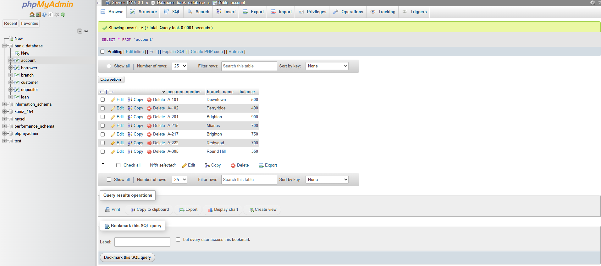

**Branch:**

```sql
ALTER TABLE branch ADD PRIMARY KEY(branch_name);
```
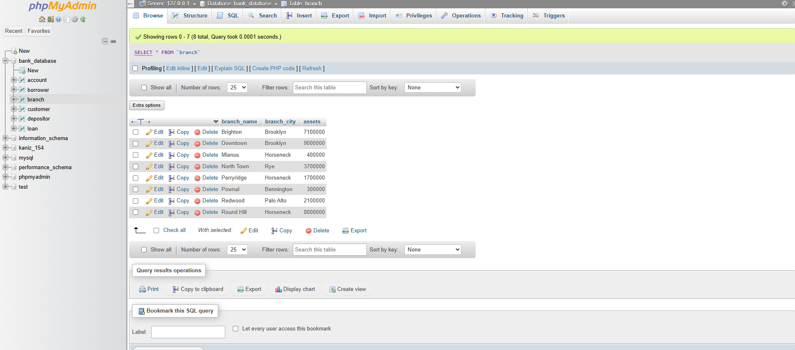

**Depositor:**

```sql
ALTER TABLE depositor ADD PRIMARY KEY(customer_name, account_number);
```
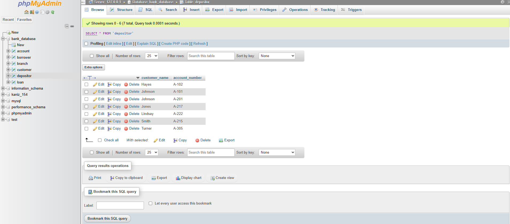

**Customer:**

```sql
ALTER TABLE customer ADD PRIMARY KEY(customer_name);
```


**Loan:**

```sql
ALTER TABLE loan ADD PRIMARY KEY(loan_number);
```
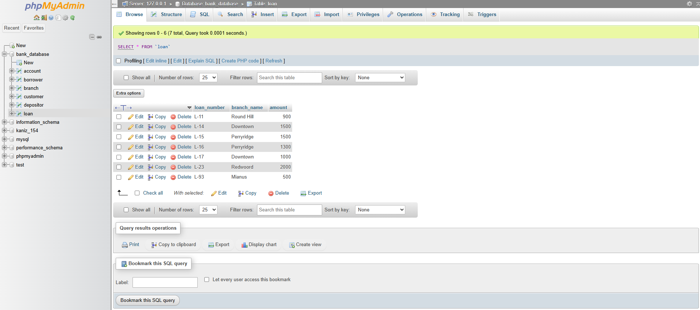

**Borrower:**

```sql
ALTER TABLE borrower ADD PRIMARY KEY(customer_name, loan_number);
```
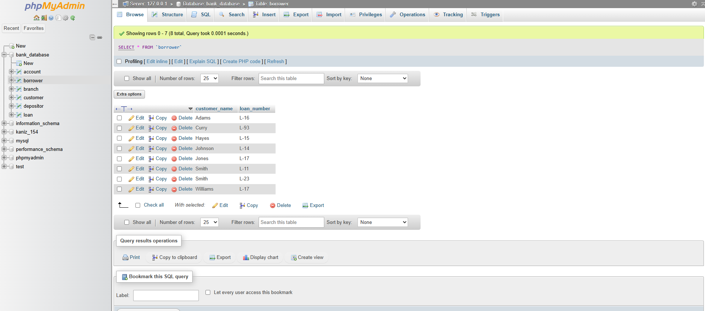

# Lab Tasks

## 1. Find the names of all branches in the `loan` relation

```sql
SELECT branch_name FROM loan;
```
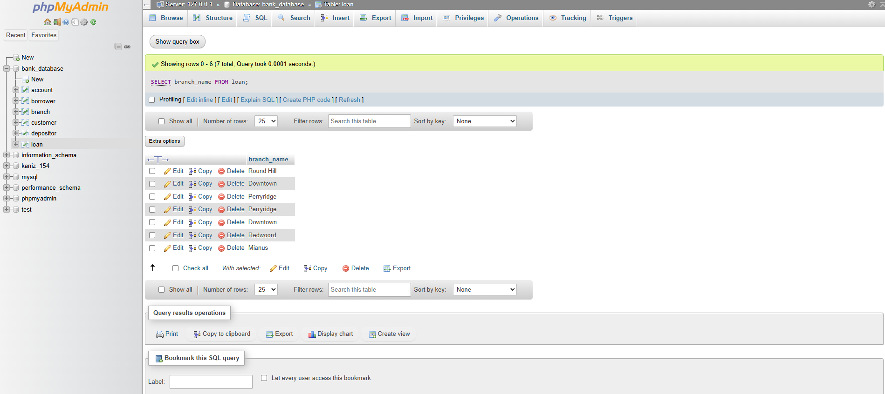

## 1. Find the names of all branches in the `loan` relation

```sql
SELECT branch_name FROM loan;
```


## 2. Find all loan numbers for loans made at the `Perryridge` branch with loan amounts greater than 300

```sql
SELECT loan_number FROM loan WHERE branch_name="Perryridge" AND amount > 300;
```
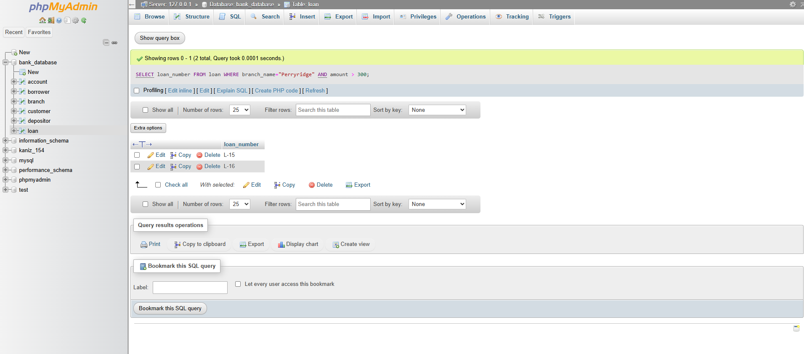

## 3. Find all the loan numbers of the customers who has loan either `Perryridge` branch or `Downtown` branch

```sql
SELECT loan_number FROM loan WHERE branch_name IN("Perryridge", "Downtown");
```
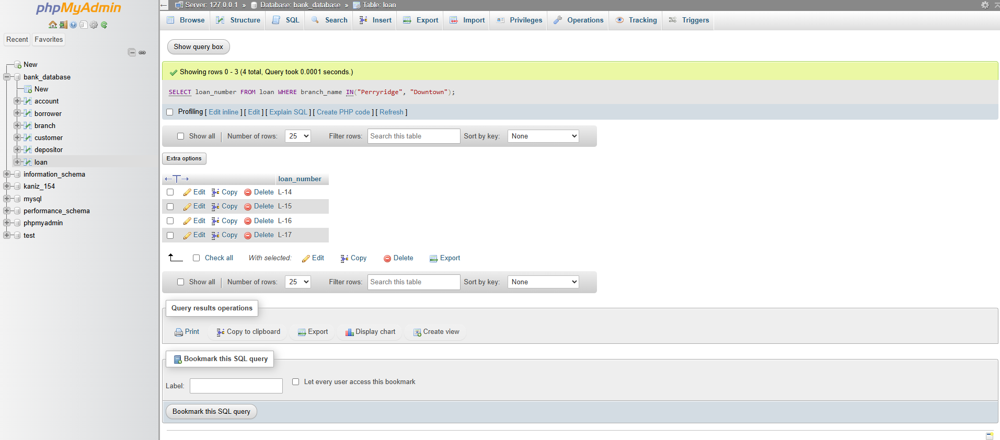

## 4. Find all the loan numbers of the customers who has loan either `Perryridge` branch or `Downtown` branch or `Mianus` branch

```sql
SELECT loan_number FROM loan WHERE branch_name IN("Perryridge", "Downtown", "Mianus");
```
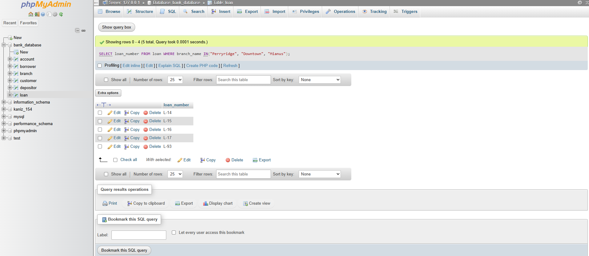

## 5. Find the names of all customers who are not from `Stamford` or `Princeton` or `Harrison` city

```sql
SELECT customer_name FROM customer WHERE customer_city NOT IN("Stamford", "Princeton", "Harrison");
```

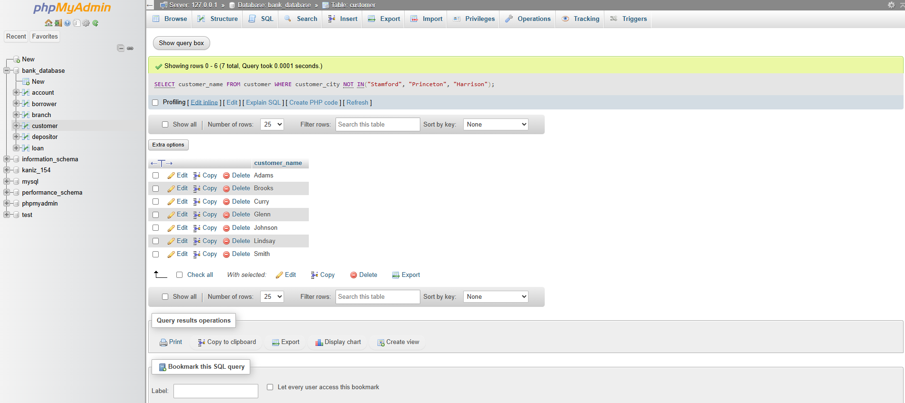

## 6. Find the largest, minimum, and average account balance in the `account` relation

```sql
SELECT Max(balance), Min(balance), Avg(balance) FROM account;
```
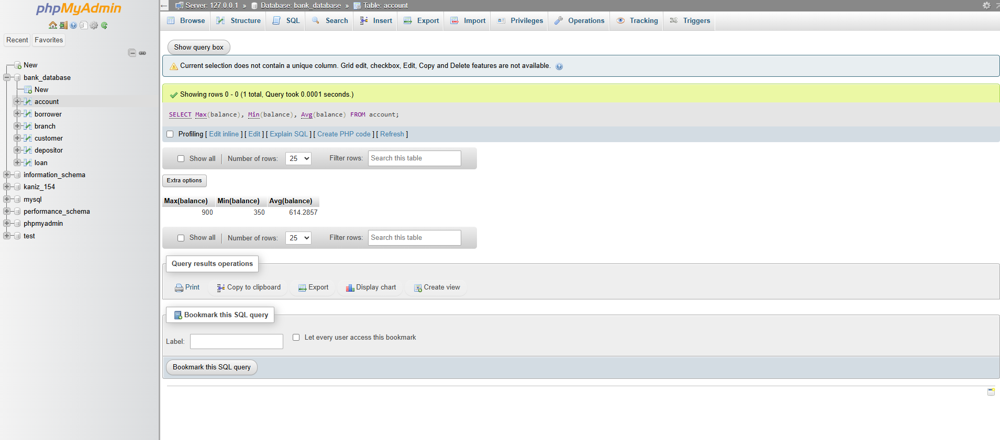

## 7. Find the total number of customer from `customer` relation

```sql
SELECT Count(customer_name) FROM customer;
```
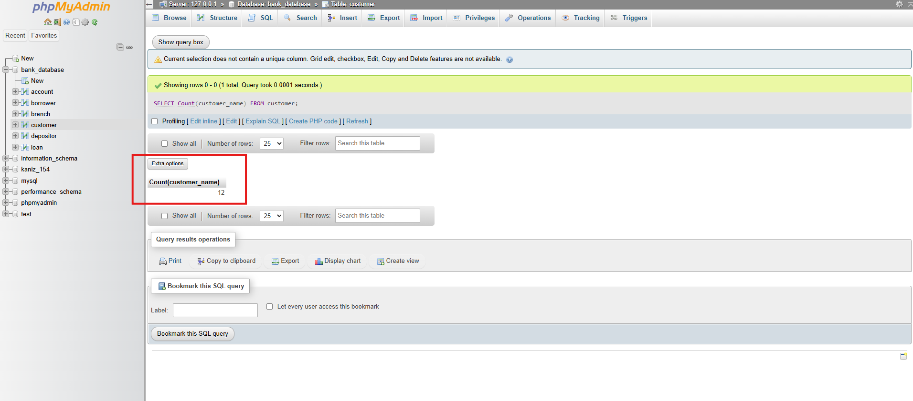

## 8. Find the loan number of those loans with loan amounts between 400 and 800

```sql
SELECT loan_number FROM loan WHERE amount > 400 AND amount < 800;
```
or
```sql
SELECT loan_number FROM loan WHERE amount BETWEEN 401 AND 799;

```


## 9. Find the names of all customers whose name start with `G`

```sql
SELECT customer_name FROM customer WHERE customer_name LIKE "G%";
```


## 10. Find the names of all customers whose name ends with `s`

```sql
SELECT customer_name FROM customer WHERE customer_name LIKE "%s";
```
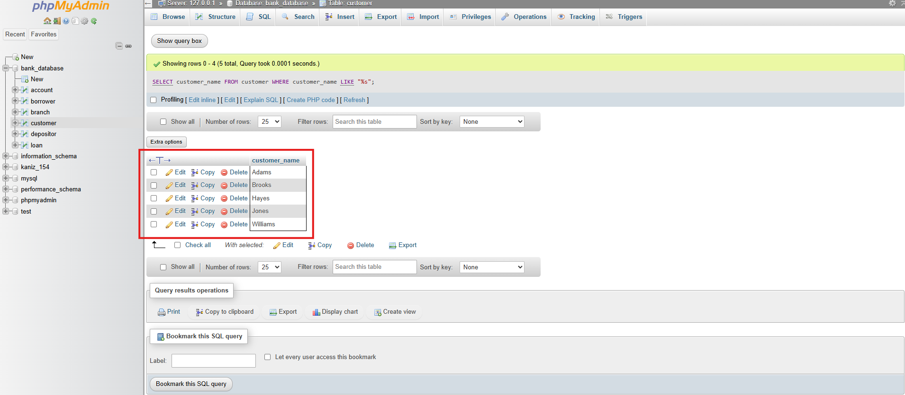

## 11. Find the names of all customers whose name has a `o` in 2nd position

```sql
SELECT customer_name FROM customer WHERE customer_name LIKE "_o%";
```
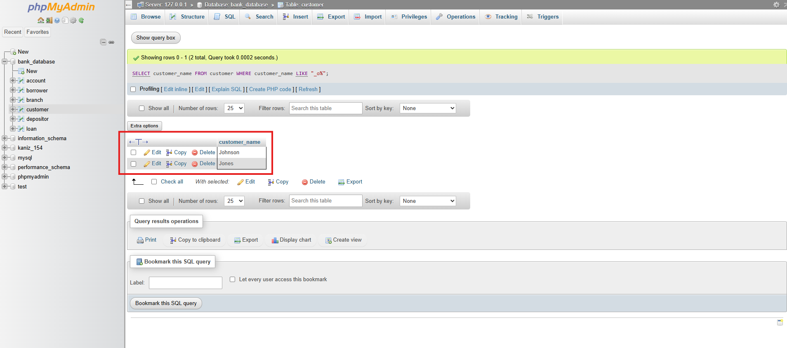

## 12. Find the names of all customers whose name has a `o` in any position except 1st and last letter

```sql
SELECT customer_name FROM customer WHERE customer_name LIKE "%o%";
```
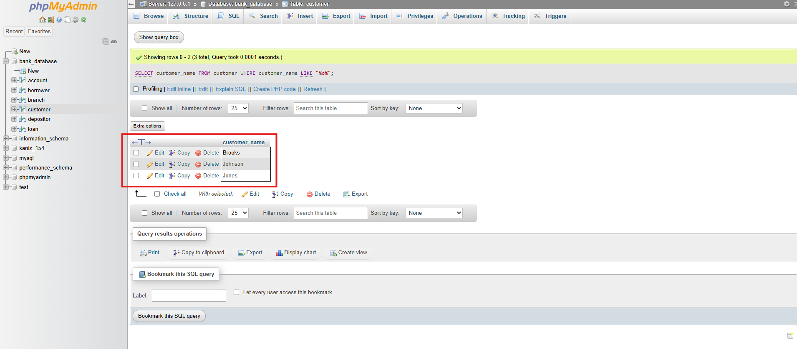

## 13. Find the length of the name of all customers from `Customer` relation

```sql
SELECT customer_name, Length(customer_name) FROM customer;
```
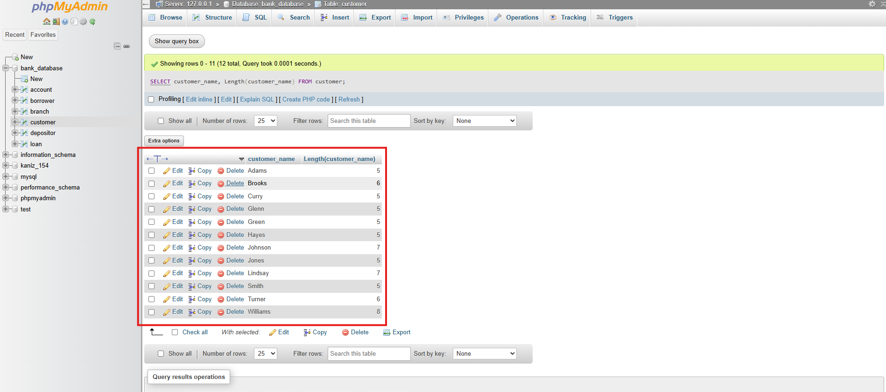

## 14. Find 1st three characters of each customer name from `customer` relation

```sql
SELECT customer_name, SUBSTR(customer_name, 1, 3) FROM customer;
```
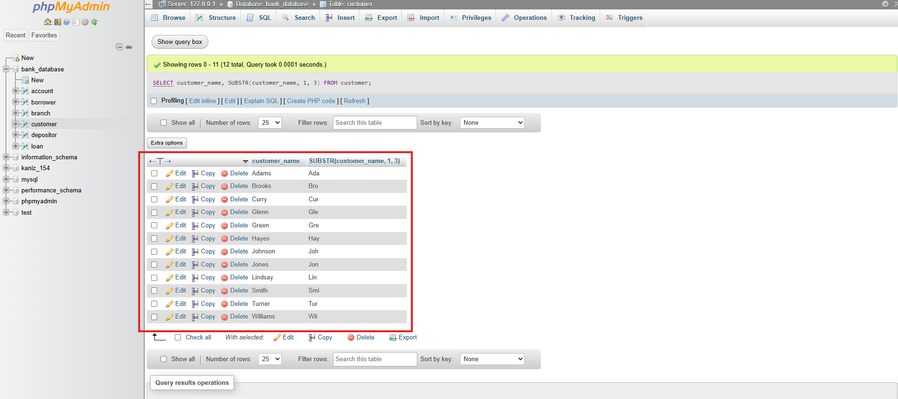