# LAB 5

## Create a DB Name "instructor154"

```sql
CREATE DATABASE instructor154
```

## Create 1 tables in this DB named "Instructor" and "Teaches"

### Instructor
```sql
CREATE TABLE Instructor (ID int(8), Name varchar(32), dept_name varchar(16), Salary int(16))
```


### Teaches
```sql
CREATE TABLE Teaches (ID int(8), c_ID varchar(32), section_ID int(2))
```
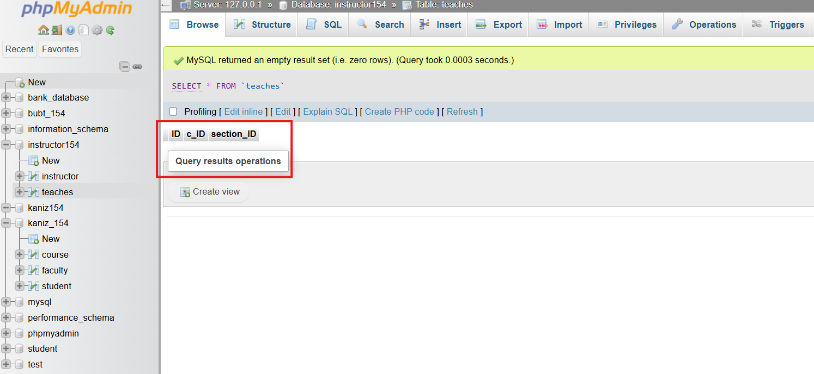

## Insert values on "Instructor" and "Teaches"

**Instructor**
```sql
INSERT INTO instructor VALUES(10101, "Srinivasan", "CSE", 65000);
INSERT INTO instructor VALUES(12121, "Wu", "FIN", 90000);
INSERT INTO instructor VALUES(15151, "Mozart", "Music", 40000);
INSERT INTO instructor VALUES(22222, "Einstein", "Physics", 90000);
INSERT INTO instructor VALUES(32343, "Said", "History", 60000);
INSERT INTO instructor VALUES(33456, "Gold", "Physics", 87000);
INSERT INTO instructor VALUES(45565, "Katz", "CSE", 75000);
INSERT INTO instructor VALUES(58583, "Cali", "History", 62000);
INSERT INTO instructor VALUES(76543, "Singh", "FIN", 80000);
INSERT INTO instructor VALUES(76766, "Crick", "Bio", 72000);
INSERT INTO instructor VALUES(83821, "Brandt", "CSE", 92000);
INSERT INTO instructor VALUES(98345, "Kin", "EEE", 80000);
```
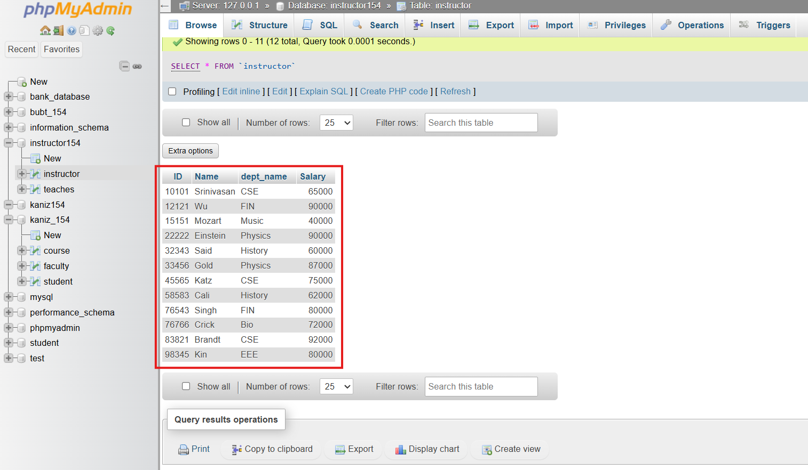

**Teaches**

```sql
INSERT INTO teaches VALUES(10101, "CSE_101", 1);
INSERT INTO teaches VALUES(12121, "CSE_111", 2);
INSERT INTO teaches VALUES(13131, "CSE_311", 3);
```
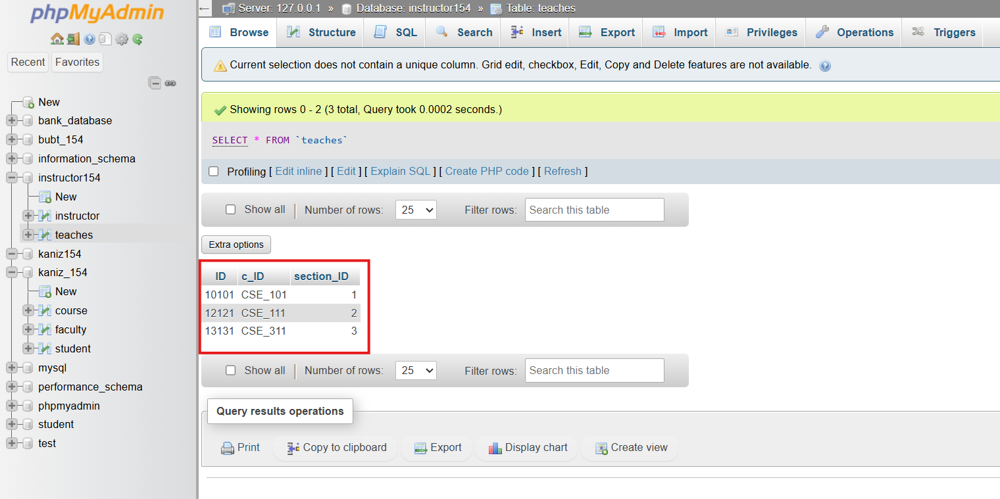

## Q1. Perform Cartesian Product Operation between these two relations.

```sql
SELECT * FROM instructor, teaches
```
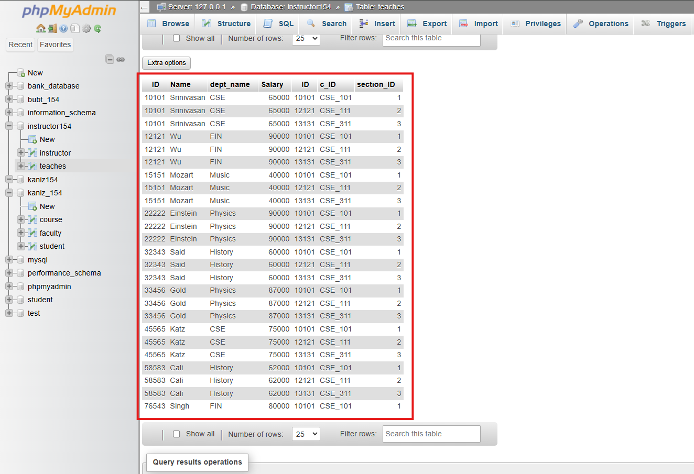

## Q2. Find  those instructors who teaches any of the courses.

```sql
Select Name, c_ID from instructor INNER JOIN teaches where Instructor.ID=teaches.ID;
```
OR
```sql
Select Name, c_ID from instructor, teaches where Instructor.ID=teaches.ID;
```
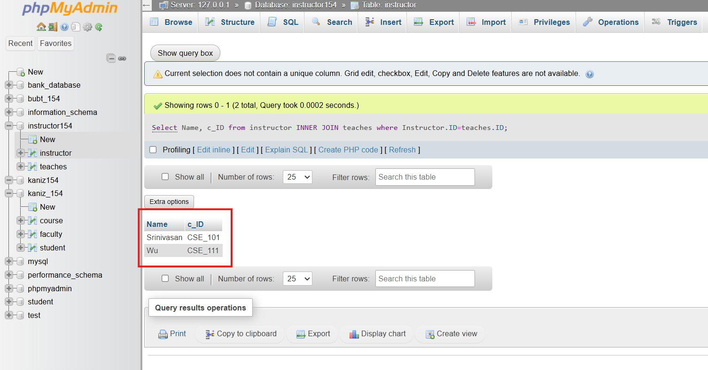

## Q3. Find only instructor names and course id for instructors in the Computer Science   department. 

```sql
Select name, c_ID from instructor INNER JOIN teaches where Instructor.ID=teaches.ID AND dept_name= "CSE";
```
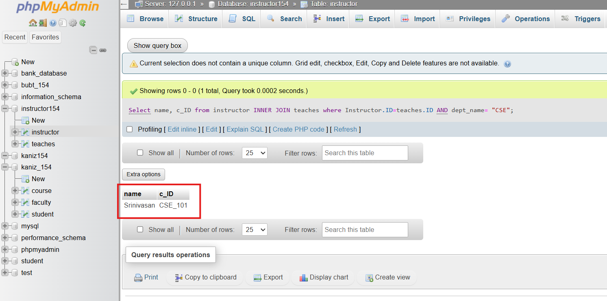

## Q4. Find the total no. of tuples in “Instructor” relation.

```sql
Select count(*) from Instructor
```
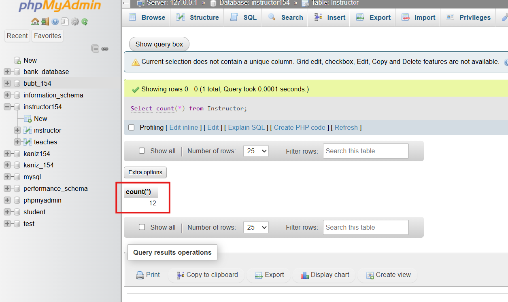

## Q5. Answer Q2 using Natural Join.

```sql
Select name, c_ID from instructor NATURAL JOIN teaches
```
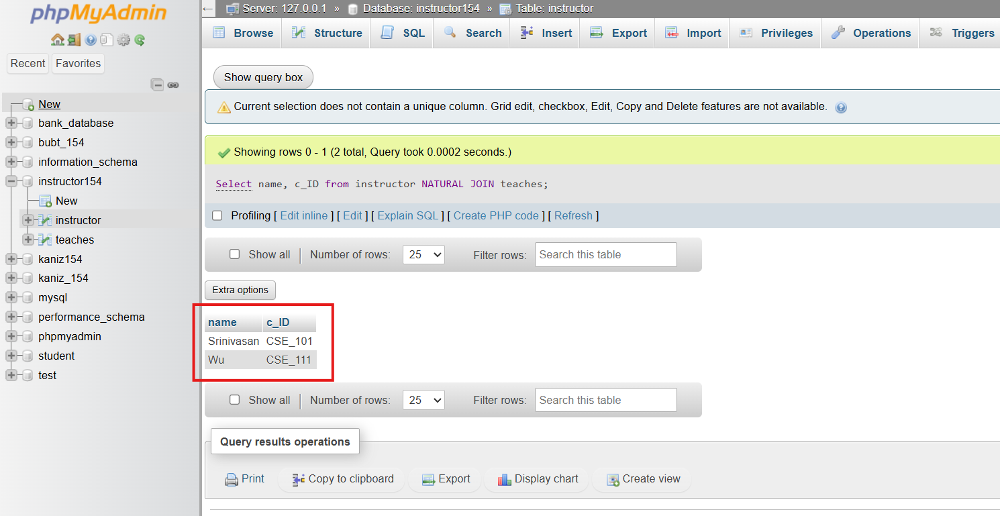

## Q6. Answer Q3 using Natural Join.

```sql
Select name, c_ID from instructor NATURAL JOIN teaches where Instructor.ID=teaches.ID AND dept_name= "CSE";
```
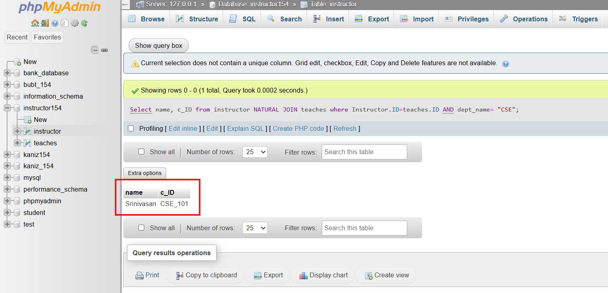

## Q7. Perform Left Outer Join.

```sql
Select * from instructor NATURAL LEFT OUTER JOIN teaches;
```
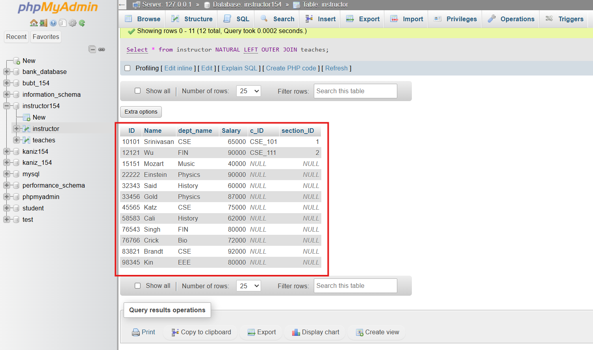

## Q8. Perform Right Outer Join.

```sql
Select * from instructor NATURAL RIGHT OUTER JOIN teaches
```
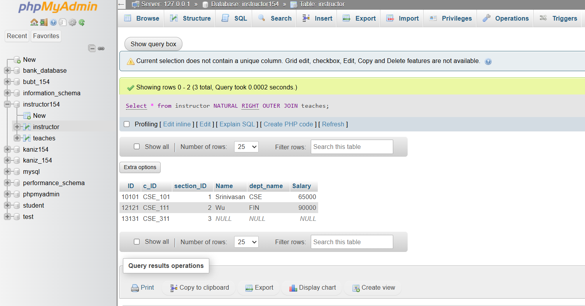

### Some extra questions I solved myself to learn more

## E1. List all instructors who do NOT teach any course

```sql
SELECT Name FROM instructor WHERE ID NOT IN (SELECT ID FROM teaches);
```
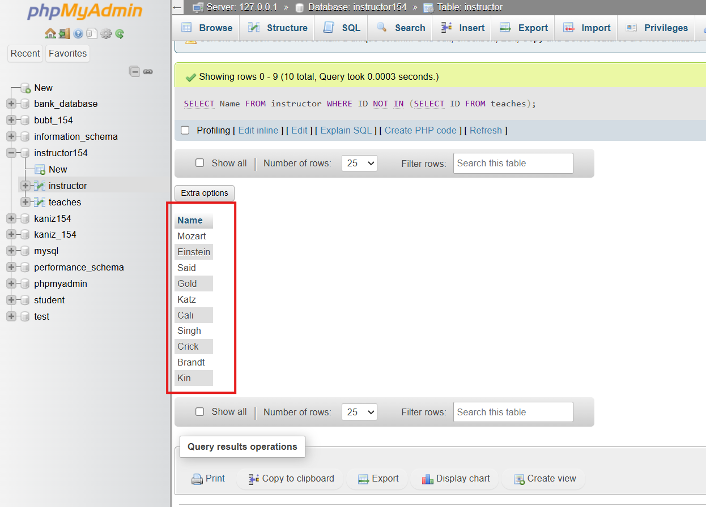

## E2. List all departments along with the average salary of instructors

```sql
SELECT dept_name, AVG(Salary) AS avg_salary  FROM instructor GROUP BY dept_name;
```
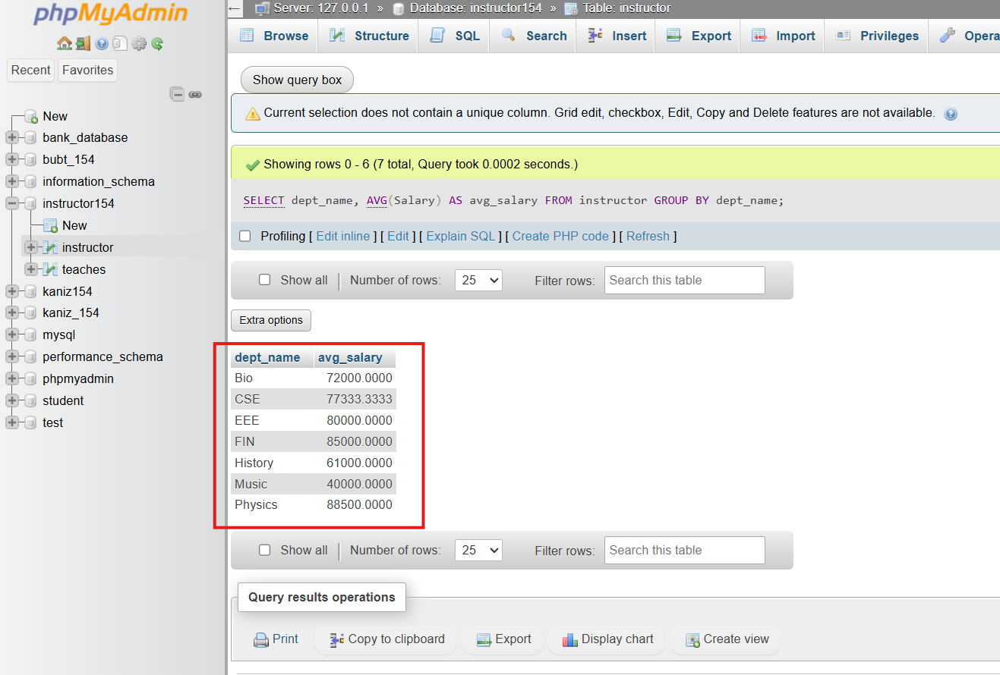

## E3. Count of instructors per department

```sql
SELECT dept_name, COUNT(*) AS num_instructors FROM instructor GROUP BY dept_name;
```
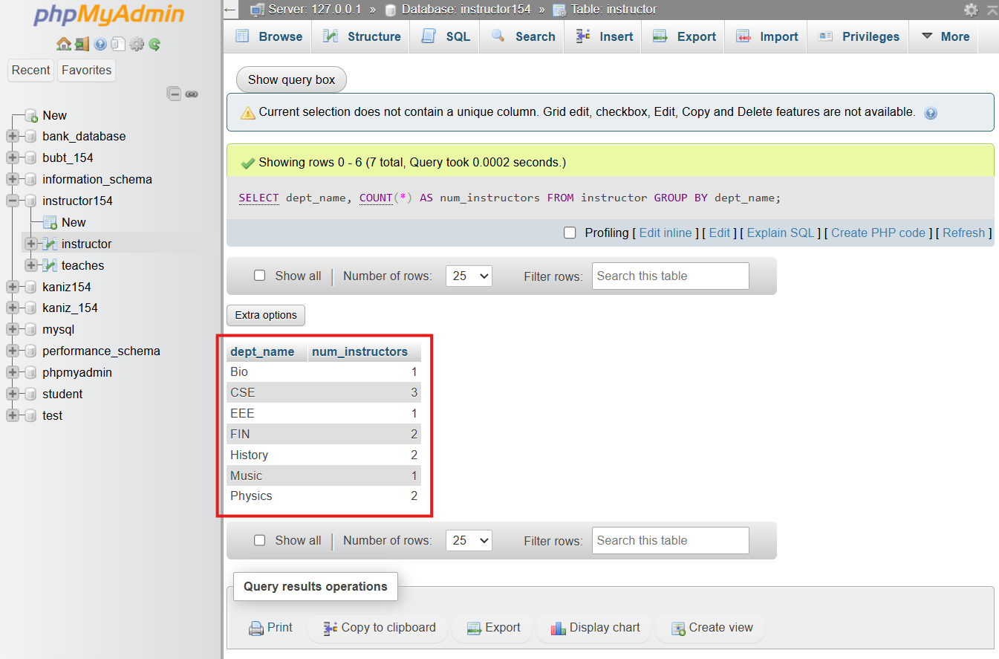