# Lab 03

**Name** Kaniz Fatema  
**ID:** 20245103154


> The Tables Used Here Are from **Bank Database**

## 1. Find the number of customers from all cities in the `customer` relation

```sql
SELECT customer_city, count(customer_name) "Total no. of customers" FROM customer GROUP BY customer_city;
```

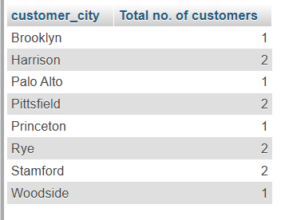

## 2. Find the total number of loans from `Loan` relation from each branch

```sql
SELECT branch_name, count(loan_number) "No. of loans" FROM loan GROUP BY branch_name;
```
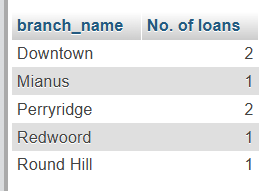

## 3. Find the total amount of loan from `Loan` relation of each branch which amount is greater than 1200

```sql
SELECT branch_name, SUM(amount) FROM loan GROUP BY branch_name HAVING SUM(amount) > 1200;
```
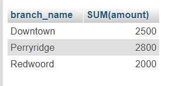

## 4. Find the average amount from each branch of `loan` relation

```sql
SELECT branch_name, AVG(amount) "Average amount" FROM loan GROUP BY branch_name;
```
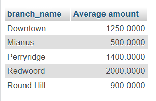

## 5. Find the total amount of each branch from `loan` relation

```sql
SELECT branch_name, SUM(amount) "Total amount" FROM loan GROUP BY branch_name;
```
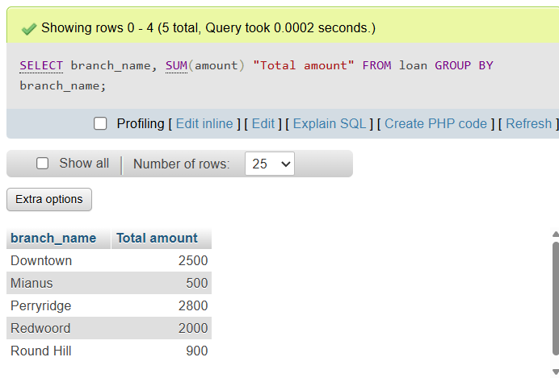

## 6. Find the total number of tuples for loan and account relation

```sql
SELECT count(*) FROM loan;
```
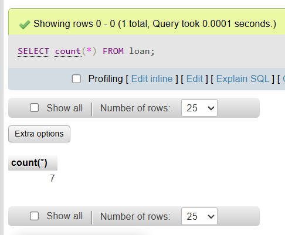

## 7. Find the average account balance of each branch whose average account balance is greater than 500

```sql
SELECT branch_name, AVG(balance) "Total balance" FROM account GROUP BY branch_name HAVING AVG(balance) > 500;
```
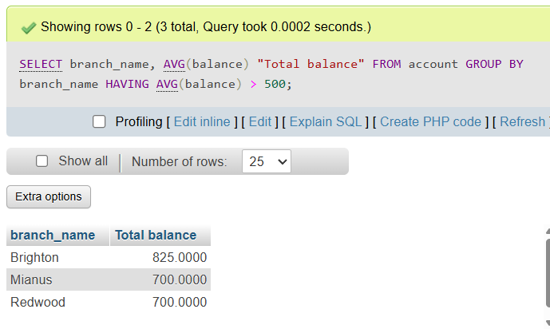

## 8. Find the name of all those customers who has either a loan or an account or both

```sql
(SELECT customer_name FROM borrower) UNION (SELECT customer_name FROM depositor);
```
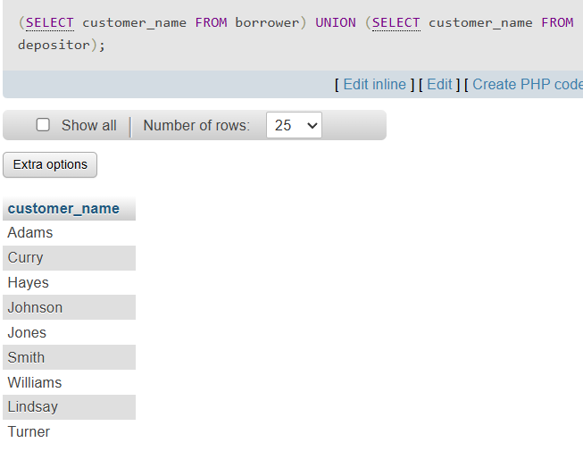

## 9. Find the name of all those customers who has both a loan and an account

```sql
(SELECT customer_name FROM borrower) INTERSECT (SELECT customer_name FROM depositor);
```
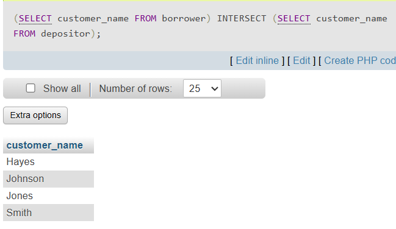

## 10. Find the name of all those customers who has only an account but not any loan

```sql
SELECT customer_name FROM depositor WHERE customer_name NOT IN (SELECT customer_name FROM borrower);
```
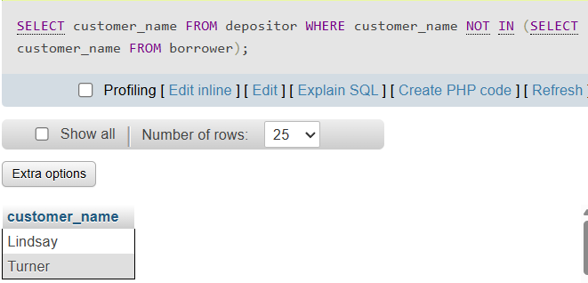

## 11. Change the column name from `branch_city` of branch relation to `city`

```sql
ALTER TABLE branch CHANGE COLUMN branch_city city varchar (32);
```

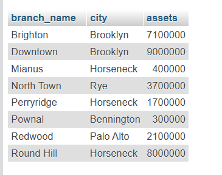