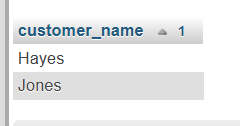
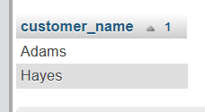
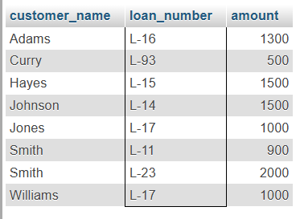
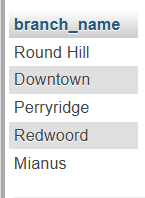
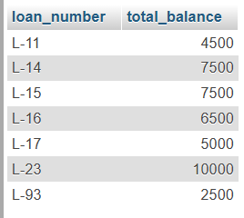
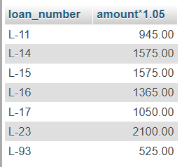
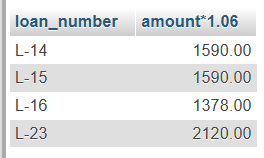
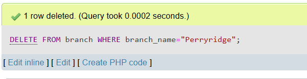
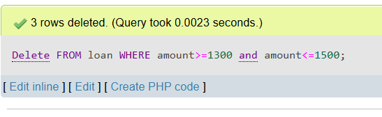

# Lab 05

**Name** Kaniz Fatema  
**ID:** 20245103154


## Q1. Fetch all the customer’s name in alphabetic order who lives in Harrison.

```sql
SELECT customer_name FROM customer WHERE customer_city="Harrison" ORDER BY customer_name
```


## ## Q2. Find the list of all customers in alphabetic order who have a loan at the "Perryridge" branch.

```sql
SELECT customer_name FROM borrower, loan WHERE borrower.loan_number=loan.loan_number AND branch_name="Perryridge" ORDER BY customer_name;
```


## Q3. Find all customers who have a loan from the bank, find their names, loan numbers and loan amount.

```sql
SELECT customer_name, loan.loan_number, amount FROM borrower, loan WHERE loan.loan_number=borrower.loan_number;
```


## Q4. Find the name of all branches from “loan” table.

```sql
SELECT DISTINCT branch_name from loan;
```


##  Q5. Find loan no and 5 times amount from loan relation and replace the column name with” total balance”.

```sql
SELECT loan_number, 5*amount as total_balance FROM loan
```


##  Q6. Increase all loan amount by 5 percent from loan relation.

```sql
SELECT loan_number, amount*1.05 FROM loan
```


##  Q8. Give 6 percent interest for all loans with amount over 1000

```sql
SELECT loan_number, amount*1.06 FROM loan WHERE amount>1000
```


##  Q9. Delete all information of Perryridge branch from branch table.

```sql
DELETE FROM branch WHERE branch_name="Perryridge"
```

##  Q10. Delete all loans with loan amounts between 1300 and 1500.

```sql
Delete FROM loan WHERE amount>=1300 and amount<=1500
```

