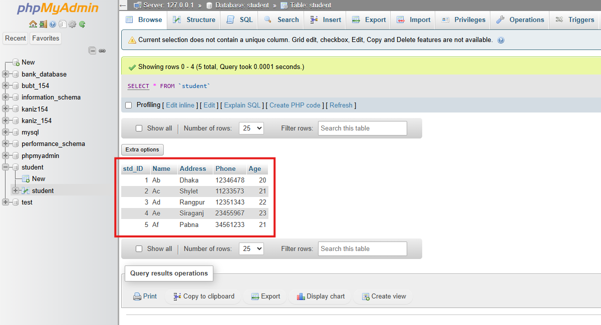

# Lab Evalution 01
This lab evaluation was on fundamental SQL operations and quries.

## Table of Contents
- Set 01: Student Database
    - [Q.0 Creating a new database](#q0-creating-a-new-database)
    - [Q.0.1 Create table named "Student"](#q01-create-table-named-student)
    - [Q.0.2 Insert values into `Student` table](#q02-insert-values-into-student-table)
    - [Q1. Find the total number of students](#q1-find-the-total-number-of-students)
    - [Q2. Find the last 3 digits from the contact number for each student](#q2-find-the-last-3-digits-from-the-contact-number-for-each-student)
    - [Q3. Find students older than the average age](#q3-find-students-older-than-the-average-age)
    - [Q4. Find students with the highest age](#q4-find-students-with-the-highest-age)
    - [Q5. Find students with 'a' in 2nd and 'g' in 4th position in address](#q5-find-students-with-a-in-2nd-and-g-in-4th-position-in-address)
    - [Q6. Increase the age of each student by 2%](#q6-increase-the-age-of-each-student-by-2)

## Set 01: Student Database
Operating SQL operations on `student` table

### Q.0. Creating a new database

```sql
CREATE DATABASE student;
```

## Q.0.1 Create 1 tables in this DB named ”Student”

**Student:** 

```sql
CREATE TABLE student (std_ID int(2), Name varchar(8), Address varchar(16), Phone varchar(16), Age float(2))
```


### Q.0.2 Insert values on `Student` Table

***Student:***
```sql
INSERT into student values(1, "Ab","Dhaka","12346478", "20");
INSERT into student values(2, "Ac","Shylet","11233573", "21");
INSERT into student values(3, "Ad","Rangpur","12351343", "22");
INSERT into student values(4, "Ae","Siraganj","23455967", "23");
INSERT into student values(5, "Af","Pabna","34561233", "21");
```


### Q1. Find the total number of students(column name should be “Total number of students”)

```sql
SELECT Count(*) "Total number of students" FROM student
```
or
```sql
SELECT Count(std_ID) "Total number of students" FROM student
```
> If `std_ID` can be NULL, then:
> - `COUNT(*)` → total rows (including NULL IDs).
> - `COUNT(std_ID)` → only students with IDs.


### Q2. Find the last 3 digits from the contact number for each student.

```sql
SELECT Phone, SUBSTR(Phone, 6, 3) "Contact" FROM student;
```


### Q3. Find the Id and Age of those students which has an age greater than the avg age of all students.

```sql
SELECT Std_ID, Age from student where Age> (SELECT AVG(Age) from student);
```


### Q4. Find the name of the students with the highest age.

```sql
SELECT Name from student where Age=(SELECT MAX(Age) from student);
```


### Q5. Find the ID of those students whose address has ‘a’ in 2nd position and ‘g’ in 4th position.

```sql
SELECT std_ID FROM student WHERE Address LIKE "_a%" AND Address LIKE "___g%"
```


### Q6. Increase the age of each student by 2%

```sql
UPDATE student SET Age = Age * 1.02;
```


