# Mid Assignment Solution

> [!NOTE]
> Use the data which have been provided for our lab work.

## Question 1. Draw the `schema diagram` from the given relations

 Database schema is the logical view of the entire database.

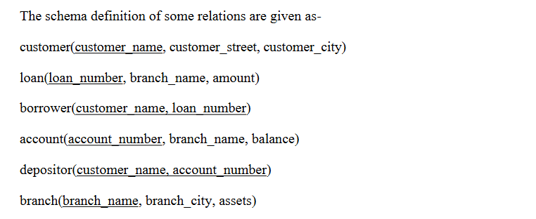
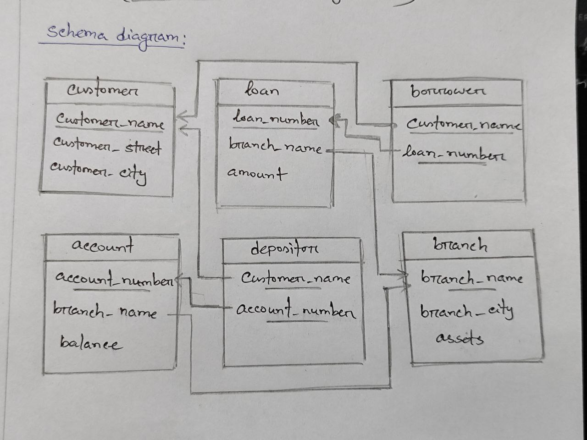

## Question 2+3. Write down the SQL and relational algebra expressions for the questions below and show the output
 
 ### 1. Find the average loan amount from each branch.

 **SQL**
 ```sql
 SELECT branch_name, AVG(amount) "Average amount" 
 FROM loan GROUP BY branch_name;
 ```
**Relational Algebra**
```math
\Large_{branch\_name}G_{AVG(amount)\ as\ "Average\ Loan"} (Loan)
```
 **Output:**

 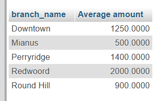

 ### 2. Write a query to show the details of a customer whose street name has two consecutive `s`.

 **SQL**
 ```sql
SELECT * FROM customer WHERE customer_street LIKE "%ss%";
 ```
**Relational Algebra**

```math
\Largeπ_{customer\_name} (σ_{customer\_street\ = \ "\%ss\%"} (Customer))
```

**Output:**

 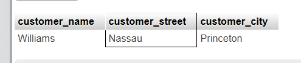

### 3. Find all customers who have a loan from the bank, find their names and loan numbers.

 **SQL**
 ```sql
SELECT customer_name, loan_number
FROM borrower;
 ```
**Relational Algebra**

```math
\Largeπ_{customer\_name,\ loan\_number} (Borrower)
```

**Output:**

 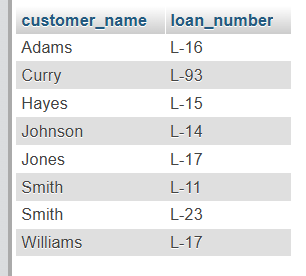

### 4. Find the list of all customers in alphabetic order who have a loan in the `Perryridge` branch.

 **SQL**
 ```sql
SELECT DISTINCT customer_name
FROM borrower NATURAL JOIN loan
WHERE branch_name = 'Perryridge'
ORDER BY customer_name ASC;
 ```
**Relational Algebra**

```math
 \pi_{customer\_name} (\sigma_{branch\_name = "Perryridge"} (Borrower\ ⨝\ Loan))
```
**Output:**

 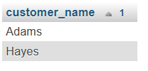

### 5. Find all customers having a loan, an account, or both at the bank.

 **SQL**
 ```sql
SELECT customer_name FROM borrower
UNION
SELECT customer_name FROM depositor;
 ```
**Relational Algebra**

```math
\Largeπ_{customer\_name}(Borrower) ∪ π_{customer\_name}(Depositor)
```

**Output:**

 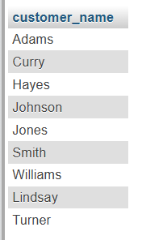

### 6. Find the names of all customers whose street address includes the substring ‘Main’.

 **SQL**
 ```sql
SELECT customer_name
FROM customer
WHERE customer_street LIKE '%Main%';
 ```
**Relational Algebra**

```math
\Largeπ_{customer\_name} (σ_{customer\_street\ = \ "\%Main\%"} (Customer))
```
**Output:**

 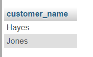

### 7. Find the average loan amount from each branch where the average loan amount is greater than 1500.

 **SQL**
 ```sql
SELECT branch_name, AVG(amount) AS "Avg Amount"
FROM loan GROUP BY branch_name HAVING AVG(amount) > 1500;
 ```
 **Relational Algebra:**

```math
\Largeγ_{branch\_name,\ AVG(amount)}\ σ_{AVG(amount)\ >\ 1500} (Loan)
```
**Output:**

 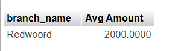

### 8. Count the number of tuples in customer relations.

 **SQL**
 ```sql
Select count(customer_name)"Num of Tuples" from customer
 ```
**Relational Algebra:**

```math
\Large G_{COUNT(Num\_of\_Tuples)} (Customer)
```

**Output:**

 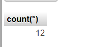

 ### 9. Find the average account balance, maximum account balance at each branch.
 **SQL**
 ```sql
SELECT branch_name, 
       AVG(balance) AS avg_balance, 
       MAX(balance) AS max_balance
FROM account
GROUP BY branch_name;
 ```
 **Relational Algebra:**

```math
branch\_name \Large G_{AVG(Avg\_balance).MAX(Max\_balance)} (Customer)
```
**Output:**

 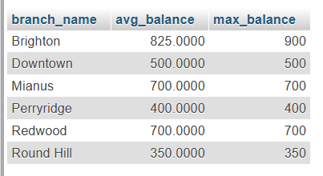

### 10. Find the names of all those customers who have a loan at Perryridge branch.
 **SQL**
 ```sql
SELECT customer_name
FROM borrower NATURAL JOIN loan
WHERE branch_name = "Perryridge";
 ```
**Relational Algebra:**

```math
\Large π_{customer\_name} ( σ_{branch\_name="Perryridge"} (Borrower\ ⨝\ Loan))
```
**Output:**

 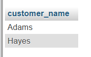

 ### 11. Delete the records of all accounts with balances below the average at that bank.
 **SQL**
 ```sql
DELETE FROM account
WHERE balance < (SELECT AVG(balance) FROM account);
 ```
**Output:**

 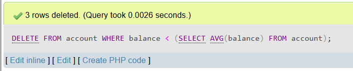
 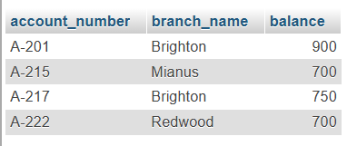

**Relational Algebra:**

```math
\Large Account ← Account − σ_{balance\ <\ AVG(balance)} (Account)
```

 ### 12. Show outputs of `JOIN Operations`
Consider the following tables `loan` and `borrower`. Perform `RIGHT OUTER JOIN`,
`LEFT OUTER JOIN`, `INNER JOIN`, and `NATURAL JOIN` operations and show the results.

**RIGHT OUTER JOIN:**
 ```sql
SELECT * FROM loan NATURAL RIGHT OUTER JOIN borrower;
 ```
 **Output:**

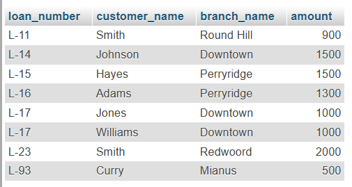
 
**LEFT OUTER JOIN:**
 ```sql
SELECT * FROM loan NATURAL LEFT OUTER JOIN borrower;
 ```
 **Output:**

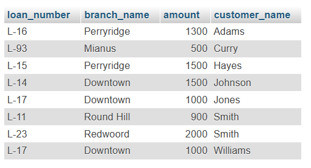
 
**INNER JOIN:**
 ```sql
SELECT * FROM loan INNER JOIN borrower;
 ```
 **Output:**

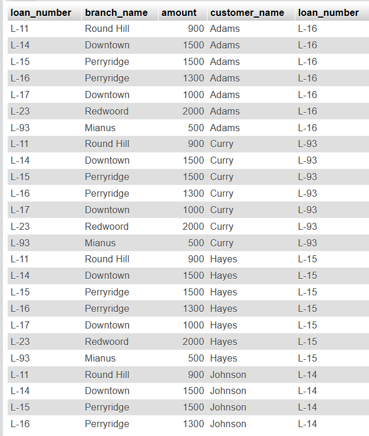

**NATURAL JOIN:**
 ```sql
SELECT * FROM loan NATURAL JOIN borrower;
 ```
 **Output:**

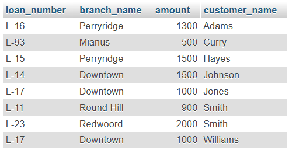

 ## Question 4. Identify all possible superkeys and candidate keys.

 Given a relation:
 ```
 Employee (EmpID, Name, Email, Phone, Department)
 ```

 **Super Key:** A super key is the basic key in a database table.

 - {EmpID}, {Email}, {Phone}, {EmpID, Name}, {Name,Email}, {Email, Phone, Department} etc..

 **Candidate Key:** The minimal set of one or more attributes which can uniquely identify a tuple/row is known as candidate key.

 > [!Note]
 > It can contain `NULL` values, but will not consider the same value.
 
 - {EmpID}, {Email}, {Phone}